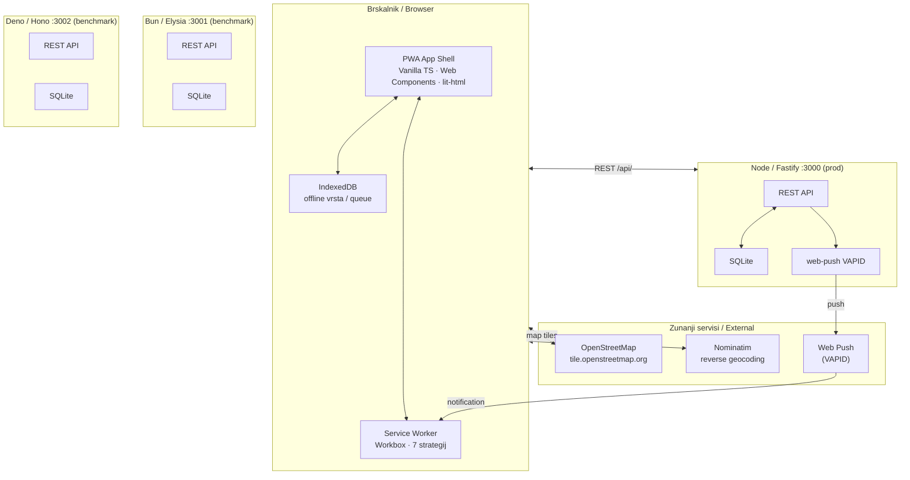

# FieldFix / PrijaviMesto

**PrijaviMesto** je progresivna spletna aplikacija (PWA) za prijavo komunalnih okvar v mestu — udarne jame, pokvarjene svetilke, grafiti, ilegalna odlagališča, poškodovani znaki.

Aplikacija deluje **brez internetne povezave**: prijava se shrani lokalno v IndexedDB in samodejno pošlje, ko se omrežje vzpostavi.

---

**FieldFix** is a Progressive Web App for citizen civic-issue reporting — potholes, broken streetlights, graffiti, illegal dumping, damaged signs. Reports can be submitted **offline** and sync automatically when connectivity returns.

---

## Arhitektura / Architecture



---

## Hiter zagon / Quick Start

```bash
# Namestitev / Install
git clone https://github.com/<username>/fieldfix.git
cd fieldfix
pnpm install

# Strežnik / Server (port 3000)
pnpm --filter server-node dev

# Odjemalec / Client (port 5173)
pnpm --filter client dev
```

Odpri / Open: [http://localhost:5173](http://localhost:5173)

Podrobna navodila: [docs/navodila-za-zagon.md](docs/navodila-za-zagon.md)

---

## Struktura projekta / Project Structure

```
fieldfix/
├── client/                 # PWA odjemalec (Vite + TypeScript)
│   ├── src/
│   │   ├── components/     # Web Components (report-list, report-form, …)
│   │   ├── sw.ts           # Service Worker (Workbox)
│   │   ├── db/queue.ts     # IndexedDB offline vrsta
│   │   ├── geo/            # Geolocation + Nominatim
│   │   ├── media/          # Kamera + Canvas kompresija
│   │   └── push/           # VAPID naročnina
│   └── tests/
│       ├── unit/           # Vitest (29 testov)
│       └── e2e/            # Playwright + axe-core
├── server-node/            # Node 22 + Fastify 5 (produkcija)
├── server-bun/             # Bun + Elysia (primerjava)
├── server-deno/            # Deno + Hono (primerjava)
├── shared/                 # openapi.yaml, schema.sql, seed.sql
├── benchmarks/             # k6 testi, rezultati, grafikoni
└── docs/                   # Slovenska dokumentacija
```

---

## API pregled / API Overview

Vsi strežniki implementirajo enake končne točke (definirane v `shared/openapi.yaml`):

| Metoda   | Pot                        | Opis                                      |
| -------- | -------------------------- | ----------------------------------------- |
| `POST`   | `/api/reports`             | Ustvari prijavo (multipart: polja + foto) |
| `GET`    | `/api/reports`             | Seznam prijav (`?status=&bbox=&page=`)    |
| `GET`    | `/api/reports/:id`         | Podrobnosti + zgodovina statusov          |
| `PATCH`  | `/api/reports/:id/status`  | Sprememba statusa (zahteva admin žeton)   |
| `POST`   | `/api/subscriptions`       | Registracija push naročnine               |
| `DELETE` | `/api/subscriptions/:hash` | Odjava push naročnine                     |
| `GET`    | `/api/health`              | Zdravstveni status                        |
| `GET`    | `/api/vapid-public-key`    | VAPID javni ključ                         |
| `GET`    | `/uploads/:filename`       | Naložene fotografije                      |

---

## Primerjava strežnikov / Server Comparison

|                          | Node/Fastify | Bun/Elysia | Deno/Hono |
| ------------------------ | ------------ | ---------- | --------- |
| **req/s** (100 VU, 60 s) | 7 785        | 7 658      | —         |
| **p95 zakasnitev**       | 11,8 ms      | 12,9 ms    | —         |
| **RSS idle**             | 118 MB       | 83 MB      | —         |
| **RSS peak**             | 231 MB       | 145 MB     | —         |
| **Čas zagona**           | 354 ms       | 129 ms     | —         |
| **LOC (src/)**           | 529          | 393        | 418       |

Celotna primerjava: [docs/streznik-primerjava.md](docs/streznik-primerjava.md)

---

## Testi / Tests

```bash
pnpm --filter server-node test     # 32 server testov (Vitest)
pnpm --filter client test          # 29 client testov (Vitest)
pnpm --filter client test:e2e      # Playwright E2E + axe-core
```

---

## Dokumentacija / Documentation

| Dokument                                                      | Vsebina                            |
| ------------------------------------------------------------- | ---------------------------------- |
| [ideja-in-ciljna-skupina.md](docs/ideja-in-ciljna-skupina.md) | Opis ideje in ciljne skupine       |
| [pwa-zmoznosti.md](docs/pwa-zmoznosti.md)                     | SW strategije predpomnjenja        |
| [web-apiji.md](docs/web-apiji.md)                             | Sodobni spletni API-ji             |
| [streznik-primerjava.md](docs/streznik-primerjava.md)         | Izmerjene primerjave strežnikov    |
| [testiranje.md](docs/testiranje.md)                           | Strategija in rezultati testiranja |
| [porocilo-dostopnost.md](docs/porocilo-dostopnost.md)         | WCAG 2.2 AA poročilo               |
| [navodila-za-zagon.md](docs/navodila-za-zagon.md)             | Podrobna navodila za zagon         |

---

## Zahteve / Requirements

- Node.js ≥ 22 LTS
- pnpm ≥ 9
- (neobvezno) Bun ≥ 1.1, Deno ≥ 2.0, k6 ≥ 0.55

---

## Licenca / License

MIT — za akademske namene / for academic purposes.

Predmet: Spletne tehnologije, FERI Maribor, prof. dr. Boštjan Šumak, 2025/26
