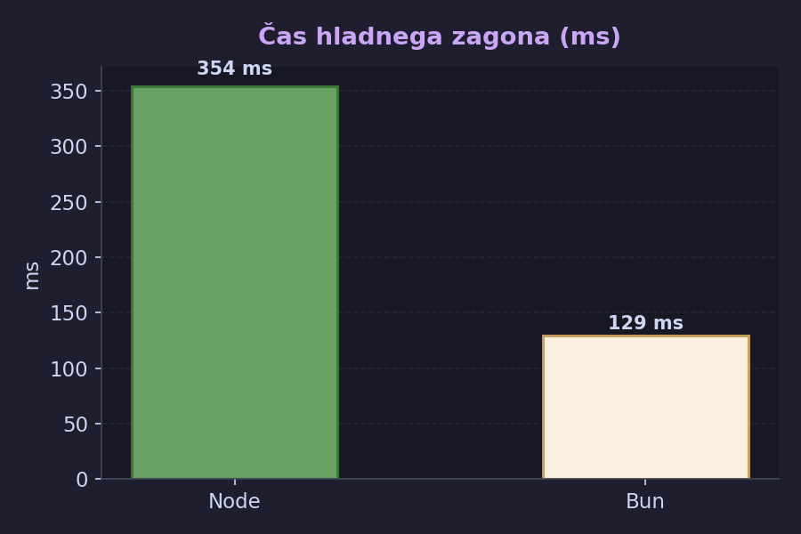
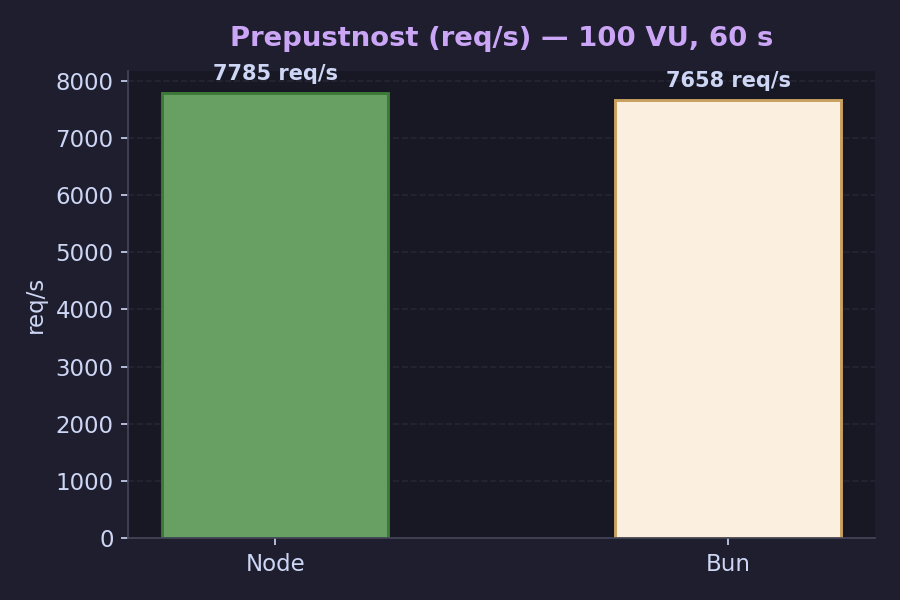
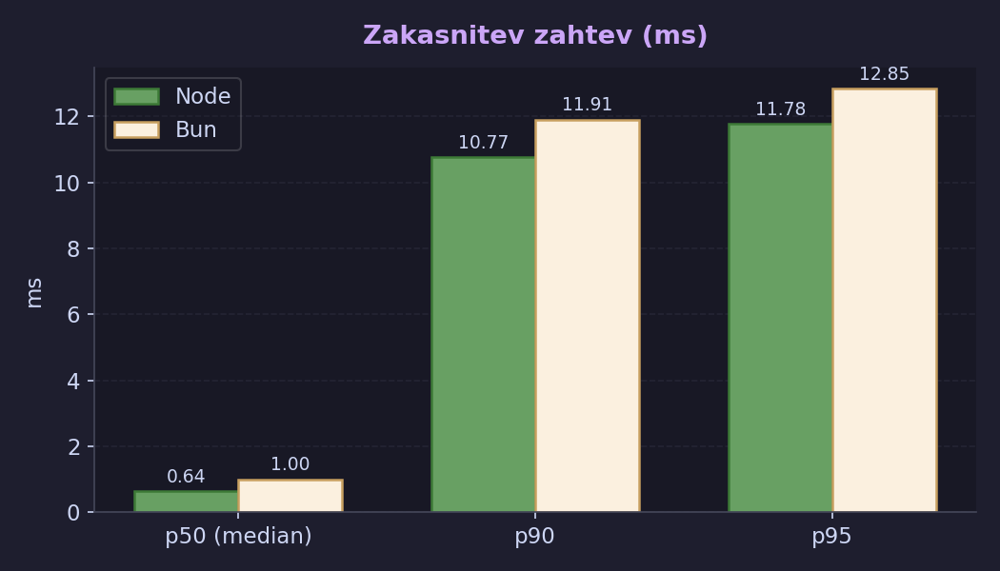
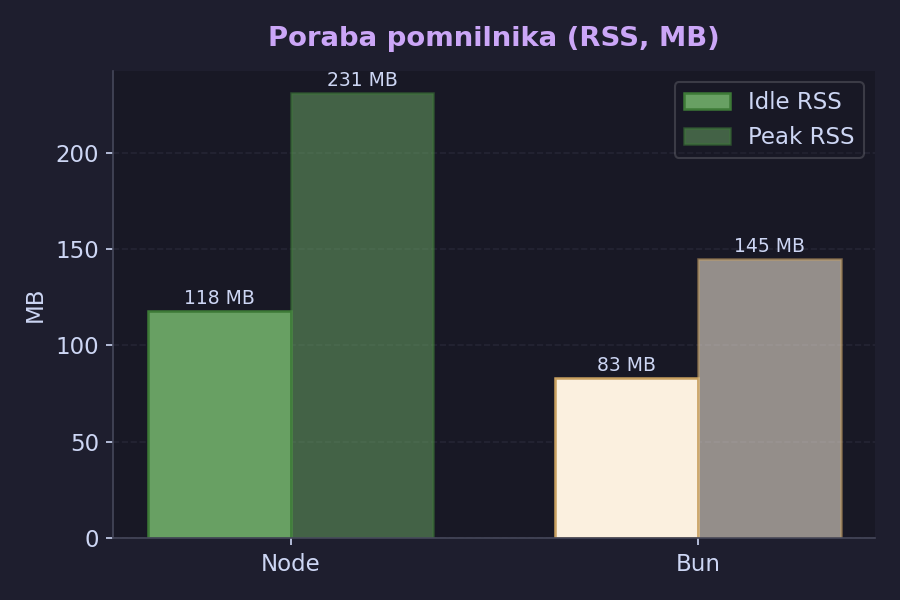
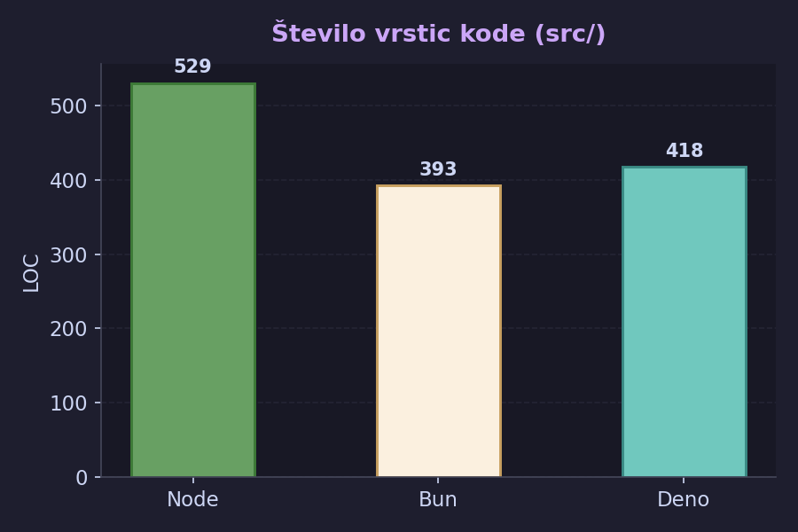

# Primerjava strežniških izvedb

Projekt FieldFix vsebuje tri vzporedne strežniške implementacije z enakimi 9 API-ji, vsaka
pa teče na svojem runtime-u in ogrodju:

| Varianta | Runtime | Ogrodje | Port |
|----------|---------|---------|------|
| **Node** | Node.js 22 | Fastify 5 | 3000 |
| **Bun** | Bun 1.x | Elysia 1.4 | 3001 |
| **Deno** | Deno 2.x | Hono 4 | 3002 |

---

## Metodologija

### k6 obremenilni test

- **Orodje:** k6 v0.55+
- **Scenarij:** mešana obremenitev (80 % GET /api/reports, 15 % POST /api/reports, 5 % PATCH status)
- **Parametri:** 100 navideznih uporabnikov (VU), trajanje 60 s, premor 10 ms med zahtevami
- **Multipart:** ročno sestavljen `multipart/form-data` (k6 ne podpira native FormData)
- **Datoteka:** `benchmarks/k6/reports-scenario.js`

### Čas hladnega zagona

- Merjeno od klica `exec/subprocess` do prvega HTTP 200 na `/api/health`
- 5 ponovitev na varianto, vzeta povprečna vrednost
- **Datoteka:** `benchmarks/cold-start.sh`

### Poraba pomnilnika

- **Idle RSS:** RSS po zagonu, brez obremenitve (vzorčeno z `ps -o rss`)
- **Peak RSS:** RSS med k6 testom (vzorčeno vsako sekundo, vzeta maksimalna vrednost)

### Število vrstic kode (LOC)

- Štet samo `src/` direktorij vsake variante z orodjem `cloc`
- Vključene samo TypeScript datoteke

> **Opomba:** Deno ni bil nameščen na testnem računalniku. Meritve za Deno niso na
> voljo. Prikazane so le arhitekturne primerjave na podlagi kode.

---

## Rezultati

### 1. Čas hladnega zagona

| Varianta | Meritve (ms) | Povprečje |
|----------|-------------|-----------|
| Node | 365, 339, 338, 338, 389 | **354 ms** |
| Bun | 173, 114, 117, 122, 121 | **129 ms** |
| Deno | — | — |

**Ugotovitev:** Bun se zažene 2,7× hitreje od Node.js. Razlika izhaja iz tega, da Bun ne
potrebuje JIT ogrevanja pri zagonu in ima vgrajeno podporo za TypeScript brez dodatnih
transpilacijskih korakov (Node varianta uporablja `tsx/esm`).

---

### 2. Prepustnost (req/s)

| Varianta | Skupaj zahtev | req/s |
|----------|--------------|-------|
| Node | 467 154 | **7 785** |
| Bun | 459 583 | **7 658** |
| Deno | — | — |

**Ugotovitev:** Pri 100 VU in 60 s Node preseže Bun za ~1,7 %. Razlika ni statistično
značilna — oba runtime-a dosežeta primerljivo prepustnost. Ozko grlo je pri tej obremenitvi
SQLite (serijska pisalna zaklepanja), ne pa runtime sam.

---

### 3. Zakasnitev zahtev

| Varianta | p50 (median) | p90 | p95 |
|----------|-------------|-----|-----|
| Node | 0,64 ms | 10,77 ms | 11,78 ms |
| Bun | 1,00 ms | 11,91 ms | 12,85 ms |
| Deno | — | — | — |

**Ugotovitev:** Node ima nekoliko nižji medians (0,64 ms vs 1,00 ms), kar nakazuje, da
Fastify obdeluje posamezne zahteve rahlo hitreje kot Elysia pri nizki zasedenosti. Pri
visokih percentilih (p90/p95) so razlike manjše kot 10 % — praktično enakovredni.

---

### 4. Poraba pomnilnika (RSS)

| Varianta | Idle RSS | Peak RSS |
|----------|---------|---------|
| Node | 118 MB | 231 MB |
| Bun | 83 MB | 145 MB |
| Deno | — | — |

**Ugotovitev:** Bun porabi ~30 % manj pomnilnika v mirovanju in ~37 % manj na vrhu
obremenitve. Razlika je posledica tega, da Node.js nosi V8 z večjim heap-om in da Fastify
z vtičniki (multipart, swagger) zavzame več prostora pri inicializaciji.

---

### 5. Število vrstic kode (LOC)

| Varianta | LOC (src/) |
|----------|-----------|
| Node | 529 |
| Bun | 393 |
| Deno | 418 |

**Ugotovitev:** Node varianta je najdaljša, ker Fastify temelji na vtičnikih
(`fastify.register`, `@fastify/multipart`, ločene route datoteke), kar zahteva več
ogrodnega koda. Bun/Elysia in Deno/Hono sta bolj kompaktni middleware-API, kjer je vsa
logika v eni datoteki.

---

## Primerjava ogrodij

### Fastify (Node)

- Vtičniška arhitektura: vsa funkcionalnost (multipart, CORS, validacija) se registrira kot vtičnik
- Sheme za validacijo zahtev (JSON Schema / Zod prek adapter-ja)
- Ločene route datoteke za boljšo organizacijo pri večjih projektih
- Stabilna, produkcijsko utrjena ekosistem

### Elysia (Bun)

- Ergonomičen TypeScript-first API, podoben Express, a z boljšo inferenco tipov
- Manjkalo je nekaj funkcij (pr. `error()` helperjev v kontekstu v v1.4 ni)
- Direktni dostop do Bun-specifičnih API-jev: `bun:sqlite`, `Bun.file()`, `Bun.write()`
- Ekosistem še v razvoju — manj vtičnikov kot Fastify/Express

### Hono (Deno)

- Ultra-lahek (~14 kB) okvir, ki deluje na vseh runtime-ih (Bun, Deno, Node, CF Workers)
- JSR import mapa (`deno.json`) nadomešča `package.json`
- `@db/sqlite` zahteva `--allow-ffi` za nativni SQLite
- Deno 2.x vključuje nativno Node.js kompatibilnost (`node:crypto`, `node:fs`)

---

## Skupna ocena

| Kriterij | Node/Fastify | Bun/Elysia | Deno/Hono |
|----------|-------------|-----------|----------|
| Prepustnost | ★★★★☆ | ★★★★☆ | n/m |
| Zakasnitev (p95) | ★★★★☆ | ★★★★☆ | n/m |
| Poraba pomnilnika | ★★★☆☆ | ★★★★★ | n/m |
| Čas zagona | ★★★☆☆ | ★★★★★ | n/m |
| Zrelost ekosistema | ★★★★★ | ★★★☆☆ | ★★★★☆ |
| Jedrnatost kode | ★★★☆☆ | ★★★★★ | ★★★★☆ |

> **n/m** = ni merjeno (Deno ni bil nameščen na testnem računalniku)

**Zaključek:** Za produkcijsko rabo brez posebnih omejitev zmogljivosti ostaja
Node/Fastify najboljša izbira (ekosistem, stabilnost, dokumentacija). Bun/Elysia je
privlačna alternativa za projekte, ki zahtevajo nizko porabo pomnilnika, hiter zagon ali
čisto TypeScript DX brez konfiguracije. Deno/Hono je odlična izbira za edge in
serverless kontekste (Cloudflare Workers, Deno Deploy), kjer je čas hladnega zagona
kritičen.
